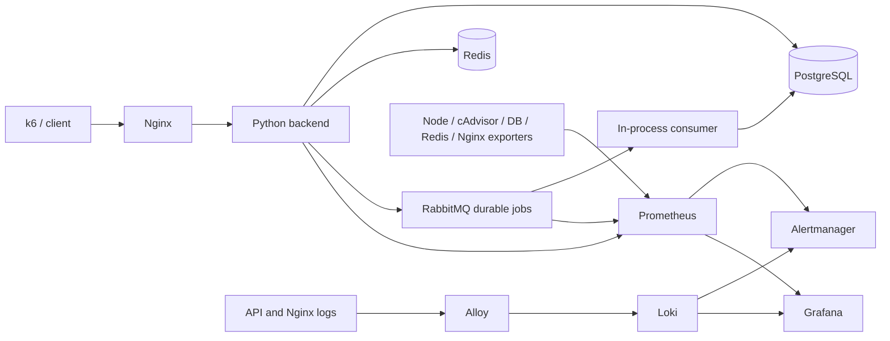

# sre-observability-lab

Production-like homelab project created to practice and demonstrate DevOps/SRE engineering patterns. It is not presented as commercial production experience.

An isolated troubleshooting lab with real HTTP requests, async queue processing, stateful dependencies, metrics, logs and bounded fault injection. No published numbers represent commercial production performance. Read [VALIDATION.md](VALIDATION.md) for the exact checks performed.



## Requirements and quick start

Docker Engine/Compose, Make, Python 3.11. Allow approximately 4 GB available Docker memory; stop the other portfolio labs before running this stack. Linux is the reference environment for cAdvisor/node metrics. Docker Desktop measures its Linux VM, and host/container visibility may differ from a native Linux host.

```bash
make init
make install test
make up
make smoke
curl -H 'Content-Type: application/json' -d '{"name":"lab-job"}' http://127.0.0.1:8180/jobs
curl http://127.0.0.1:8180/jobs
make load
```

Async processing means GET `/jobs` may initially be empty. POST returns 202 only after a broker publisher confirmation. RabbitMQ was selected for durable queues, acknowledgements, publisher confirmations and a built-in Prometheus endpoint. Messages are persistent and queues durable; SQL deduplication uses the message UUID. Delivery is at least once; retries of POST can create distinct UUIDs. There is no transactional outbox. The consumer shares the backend process for lab simplicity; transient failures requeue with a one-second backoff. A production worker needs a separate deployment, bounded retry/dead-letter policy and poison-message handling.

Nginx: localhost:8180; Prometheus: localhost:9190; Grafana: localhost:3101 (admin and generated `.env` password); Alertmanager: localhost:9193. Grafana has provisioned Prometheus/Loki sources and a service/infrastructure dashboard. Loki is internal. Alertmanager receives alerts without sending external notifications.

## Telemetry

RPS/status/latency histograms come from the backend; p50/p95/p99 are computed using `histogram_quantile`. They exclude probes and metrics scrapes. Edge 502/504 requests never reach the backend; use Nginx access logs and the Loki gateway alert. Node exporter measures CPU/RAM/disk/network, cAdvisor measures container CPU/RAM, PostgreSQL and Redis exporters measure dependencies, RabbitMQ exposes broker metrics, and Nginx stub_status exposes connection/request counters (not HTTP status breakdown). Loki stores structured backend and edge logs. No missing exporter is treated as zero usage.

Alerts cover unavailable backend, server-error fraction, p95, RSS, dependency failures, PostgreSQL connections, Redis, queue backlog, edge gateway errors, resource-pressure CPU, low disk and exporter availability. Thresholds are lab choices, not promised production SLOs. The PostgreSQL ratio can disappear when all connection slots are exhausted; correlate exporter-down and API errors. See [SLO.md](SLO.md).

## Incidents and recovery

Run one scenario at a time and restore baseline before the next. `make load` has strict normal-operation thresholds and is expected to exit nonzero during injected faults; observe it as failed client experience, not a broken setup.

```bash
bash scripts/incident.sh latency
bash scripts/incident.sh postgres
bash scripts/incident.sh redis
bash scripts/incident.sh nginx
bash scripts/incident.sh resources
make recover
make smoke
```

The commands above are a catalogue, not a sequence to run without recovery. [INCIDENTS.md](INCIDENTS.md) explains each exercise; [RUNBOOK.md](RUNBOOK.md) provides first-response checks. Database blockers and CPU pressure auto-expire after 120 seconds and can be stopped sooner. Latency is bounded to ten seconds. The resource scenario stresses only a 64 MiB/0.25 CPU container and never fills the host disk.

## Security, limitations and cleanup

`.env.example` lists variables; `make init` generates random credentials in ignored `.env` with mode 0600. Ports bind only loopback. Backend is non-root/read-only and drops capabilities. Redis/API/monitoring lack authentication and HTTP is unencrypted; keep the network private. Database exporter uses the local lab role, not a production least-privilege monitoring role. cAdvisor is privileged and mounts host paths plus the Docker socket (a read-only socket mount does not restrict Docker API operations); use only on a trusted lab host, never accept arbitrary images on that host. Alloy uses log-volume mounts without the Docker socket. RabbitMQ admin credentials are generated and its UI is not published.

Single-instance databases/broker/monitoring have no HA guarantee. Named volumes survive `make down`; this is persistence, not a backup. Do not remove volumes as an incident recovery shortcut. `docker compose ps` and logs distinguish startup/credential/port failures. On Docker Desktop, container panels use cgroup IDs; map them with `docker inspect`. Node filesystem mounts can reflect the macOS bind mount, while CPU/RAM/network describe the Linux VM. Native Linux monitoring remains a separate validation boundary. No external alert delivery, public DNS, TLS, Kubernetes or cloud service is claimed here; those belong to other portfolio scopes.

This lab demonstrates evidence-led triage, bounded failure injection, edge versus backend visibility, queue semantics, RED/USE metrics, proposed SLOs and recovery verification.

See [local image security findings](docs/security-scan.md) and [publishable repository tree](TREE.txt).
